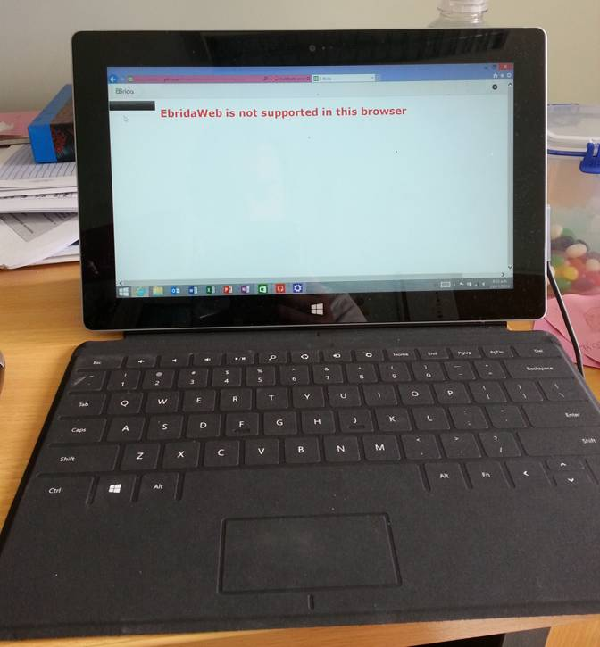

## In response to

*Given that the purpose of these desktops/laptops is to facilitate software development for powerPlant, the developers need to explain why MacOSX machines are the* ***best*** *solution.*
 
*The underlying requirements analysis (including both the powerPlant development work and other tasks that these users need to undertake), the range of solutions considered and the basis for choosing MacOSX as the best solution is not clear from the request.*
 
*How, for example, would software versions and permissions in the MacOSX desktop be kept synchronised with those in powerPlant? An alternative possible solution would be for virtual machines on the developer’s (Windows) desktops to be periodically refreshed from a powerPlant server “gold standard” virtual machine image. This solution could be implemented quite easily and with minimal cost.*

## The **best** solution

 *"It isn't the mountains ahead to climb that wear you out; it's the pebble in your shoe."* -- Muhammad Ali

One has to emphasise that developing analytical software in the Bioinformatics space is fundamentally different from software development processes in the business world. We are not software developers! We have to consider less skilled developers and much more diversity in the 
tools we use (Perl, Python, R, Java, Web dev, C, C++, etc.). All of these tools are Unix based and run on Windows machines very inefficiently. 

The advantages of MacOSX are thus:

* MacOSX provides an excellent Desktop system for the less skilled developer compared to Linux (particularly as a VM)  which tends to be nerdy. 
* The great part of the bioinformatics industry uses MacOSX machines. Compability with the industry is adamant.
* Mac OSX provides Microsoft Office products including Lync
* Mac OSX also provides:
*   a POSIX terminal
*   Longevity

#### Office, Lync and Provisioning

* http://www.microsoft.com/nz/mac/products
* http://www.microsoft.com/nz/mac/enterprise/lync
* http://www.apple.com/nz/business/programs/

## Clarity of the request

In no way is the new way of working influenced by the image or marketing of Apple products. Instead a pragmatic response to getting things done with the least effort.

| Feature | Windows | Linux | OS X |
|:--------|---------|-------|------|
| GCC     | No (MinGW) | Yes | Yes |
| X11     | No (NX)    | Yes | Yes |
| Bioinformatics Software | Not 100% | Yes | Yes |
| docker  | No (boot2docker) | Yes | boot2docker |
| Office  | Yes     | No | Yes |
| Lync    | Yes     | No | Yes |
| iOS dev env | No | No | Yes |
| Android dev env | Yes | Yes | Yes |

workarounds that have issues in brackets

## Synchronicity with powerPlant

First of all the gold standard VM provided is merely bronze. The reason is that IKS uses CentOS as a gold standard. CentOS is EXTREMELY conservative 
and causes trouble in an innovative and volatile environment. To give an example: There is a Linux distribution out there (Biolinux) 
that has almost ALL software preinstalled that currently runs on powerPlant. However,  it is a Ubuntu and thus not gold standard as per IKS. 
It would have saved 10s of thousand $$$ if we could have used that as a gold standard. Instead we has to install software from scratch and 
maintain it which causes that iPLant is fairly out of date already.

Docker is easy installed on Mac OSX machines (in the contrary to windows) and will help us keeping in sync with powerPlant. However, 
even if we should need a CentOS VM "gold" standard on our Desktops for development purposes this can be easily done on a Mac OSX machine as well. 
Further, we would even prefer doing this on MacOSX as virtualisation is much easier on Unix based machines by using tools like Vagrant.

## Further information

### Modern tooling

* https://github.com/blog/1840-improving-github-for-science and play http://youtu.be/iUcm5COsKJo making specific observations on the make of laptops used at the rOpenSci Hackathon. I observed at most 3 IBM laptops vs rest Apple Macbook Air/Pro
  * Etsy's data analysts useR on OS X (revenue [US$500 million in 2011](http://en.wikipedia.org/wiki/Etsy))
  * UC Davis [Ciera Martinez](https://github.com/iamciera)
  * many others
* [Use the right tools](https://nostrongbeliefs.com/modern-tooling/), a story from nodejs dev. 

### Comments received verbally or via email

**Microsoft bioinformatics and why open source**
*If we'd waited around for the Microsoft solution for our bioinformatics software, we would still be waiting*

**With reference to boot2docker**
*"I tried on Win and it doesnt really work. Fact is, WINs  no go as a modern dev environment for leading technologies"*

**Case put forward to CIO 26 August 2014**

1. In the past year I have conducted my research on PFR windows and Linux hardware, Linux virtual machines and my personal Mac computers. My PFR laptop is not meeting my current needs. 
2. My work involves a diverse mix of scientific computing and desktop work for communication, reporting and delivery. Ability to natively run Microsoft Office and Lync is essential, eliminating Linux as a practical option for me.
3. For my scientific computing activities, a native Posix compliant shell is essential. Currently I rely on a mix of Powershell, Git Shell and Putty. This is messy, unproductive and frustrating.
4. I absolutely require a stable, highly configurable working environment that can be readily migrated to another machine when required i.e. Migration assistant. Stability, performance and usability of my Windows 7 installations have been poor. 
5. The focus of my work is using and developing modern, best practice scientific computing tools. The 'industry standard' for scientific computing is  now Unix variants OSX and Linux. Support for Windows is limited, slow to arrive and challenging to configure. I require  access to the 'industry standard' core unix tools and scripting languages as a standard, not through laborious third party add-ins with poor compatibility.
6. The latest PFR citrix services enable handling of cases where 'Windows Compatibility" issues arise. My only concern would be ability to use Sharepoint check in. However despite my strong advocacy for iPlant I do not consider there to be much future for best-practice science  in systems where there is  browser  lock in. 
7. Leading development and deployment tools are primarily available for osx and Linux. 
8. I need a machine with specs sufficient to allow running virtual appliances for analytical and development purposes.
9. I require  a portable option due to working out of the office for training, travel and working at home.

**With reference to ansible**
*"Does ansible work like so on the poor-mans-OS aka Win7?"*

**With reference to "A number of tablets have been recently purchased that require Windows 8 for its improved support of touch screens and ruggedized construction suited field work."**

* Windows 8 has a [4.3% share](http://tabtimes.com/resources/the-state-of-the-tablet-market/) of the tablet market and the economics of software and hardware accessory development leads to a comparable share of software and hardware accessories available for Windows devices and often with a premium attached. In terms of ruggedization, this can simply be achieved with [Pelican cases](http://www.pelicanprogear.com.au/products_pgs/ce2180.php) rather than the 'bespoke' Windows systems.
* "After much research the company bought ~5 windows 8 RT tablets" 

 *"When you're screwing up and nobody says anything to you anymore, that means they've given up on you."* -- Randy Pausch 
